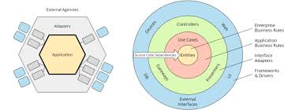

# Hexagonal Architecture (Ports & Adapters) for C# – Senior Software Architect Training

Welcome! This guide is designed for learners with attention deficit, focusing on clarity, actionable steps, and real-world production examples. You’ll learn Hexagonal Architecture (Ports & Adapters) in C# by following hands-on instructions. **No code files are created for you – you’ll type and run everything yourself.**

---

## What is Hexagonal Architecture (Ports & Adapters)?

It's called "Hexagonal" because the original diagrams used a hexagon shape to show that the core can have many different types of connections (ports/adapters) on any side, not just top and bottom like traditional layers.



<sub>Source: Alistair Cockburn, ddd-crew/hexagonal-architecture</sub>

Hexagonal Architecture (also called Ports & Adapters) is a way to structure your application so that:
- The core business logic is isolated from external systems (UI, DB, APIs).
- All communication with the outside world happens through "ports" (interfaces) and "adapters" (implementations).
- The application is easy to test, maintain, and extend.

**Key Concepts:**
- **Core (Domain/Application):** Business rules, use cases.
- **Ports:** Interfaces that define how the core interacts with the outside world (e.g., repositories, services, controllers).
- **Adapters:** Implementations of ports (e.g., database adapters, web controllers, external APIs).

---

## 1. Folder Structure (Create this yourself)

```
/YourProject
  /Domain
    - Entities/
    - Services/
  /Application
    - UseCases/
    - Ports/
  /Adapters
    - Inbound/   # e.g., Web API controllers
    - Outbound/  # e.g., DB, external services
  /Infrastructure
    - Data/
    - ExternalServices/
```

---

## 2. Step-by-Step: Build a Real-World Example

We’ll build a simple **Bank Account** system.

### 2.1. Create the Solution and Projects

Open a terminal and type:

```sh
# Create a solution and projects
mkdir HexArchDemo
cd HexArchDemo

dotnet new sln -n HexArchDemo

dotnet new classlib -n Domain

dotnet new classlib -n Application

dotnet new classlib -n Adapters

dotnet new classlib -n Infrastructure

dotnet new webapi -n WebApi

# Add projects to solution

dotnet sln add Domain/Application/Adapters/Infrastructure/WebApi

# Add references

dotnet add Application reference Domain

dotnet add Adapters reference Application Domain

dotnet add Infrastructure reference Application Domain

dotnet add WebApi reference Adapters Infrastructure Application Domain
```

---

### 2.2. Define the Domain (Core)

**File:** Domain/Entities/BankAccount.cs

```csharp
namespace Domain.Entities
{
    public class BankAccount
    {
        public int Id { get; set; }
        public decimal Balance { get; set; }
        public void Deposit(decimal amount) => Balance += amount;
        public void Withdraw(decimal amount) => Balance -= amount;
    }
}
```

---

### 2.3. Define Ports (Interfaces)

**File:** Application/Ports/IBankAccountRepository.cs

```csharp
using Domain.Entities;
using System.Collections.Generic;

namespace Application.Ports
{
    public interface IBankAccountRepository
    {
        IEnumerable<BankAccount> GetAll();
        BankAccount GetById(int id);
        void Save(BankAccount account);
    }
}
```

---

### 2.4. Implement Use Case (Application)

**File:** Application/UseCases/GetAccountsUseCase.cs

```csharp
using Application.Ports;
using Domain.Entities;
using System.Collections.Generic;

namespace Application.UseCases
{
    public class GetAccountsUseCase
    {
        private readonly IBankAccountRepository _repo;
        public GetAccountsUseCase(IBankAccountRepository repo)
        {
            _repo = repo;
        }
        public IEnumerable<BankAccount> Execute() => _repo.GetAll();
    }
}
```

---

### 2.5. Implement Outbound Adapter (Infrastructure)

**File:** Infrastructure/Data/InMemoryBankAccountRepository.cs

```csharp
using Application.Ports;
using Domain.Entities;
using System.Collections.Generic;
using System.Linq;

namespace Infrastructure.Data
{
    public class InMemoryBankAccountRepository : IBankAccountRepository
    {
        private readonly List<BankAccount> _accounts = new();
        public IEnumerable<BankAccount> GetAll() => _accounts;
        public BankAccount GetById(int id) => _accounts.FirstOrDefault(a => a.Id == id);
        public void Save(BankAccount account)
        {
            var existing = GetById(account.Id);
            if (existing == null) _accounts.Add(account);
            else existing.Balance = account.Balance;
        }
    }
}
```

---

### 2.6. Implement Inbound Adapter (Web API)

**File:** Adapters/Inbound/BankAccountsController.cs

```csharp
using Application.UseCases;
using Application.Ports;
using Domain.Entities;
using Infrastructure.Data;
using Microsoft.AspNetCore.Mvc;

[ApiController]
[Route("api/[controller]")]
public class BankAccountsController : ControllerBase
{
    private readonly GetAccountsUseCase _getAccounts;
    private readonly IBankAccountRepository _repo;

    public BankAccountsController()
    {
        _repo = new InMemoryBankAccountRepository();
        _getAccounts = new GetAccountsUseCase(_repo);
    }

    [HttpGet]
    public IEnumerable<BankAccount> Get() => _getAccounts.Execute();

    [HttpPost]
    public IActionResult Post(BankAccount account)
    {
        _repo.Save(account);
        return Ok();
    }
}
```

---

## 3. Run the Example

```sh
cd WebApi

dotnet run
```

- Visit: http://localhost:5000/api/bankaccounts
- Use Postman or curl to POST new accounts.

---

## 4. Real-World Production Tips

- Use Dependency Injection (built-in in ASP.NET Core)
- Replace InMemoryBankAccountRepository with a real DB (e.g., EF Core)
- Add validation, error handling, logging
- Write unit tests for Use Cases and Adapters
- Keep controllers/adapters thin – all logic in Use Cases

---

## 5. Further Reading
- "Implementing Hexagonal Architecture" by Alistair Cockburn
- Microsoft Docs: https://learn.microsoft.com/en-us/dotnet/architecture/modern-web-apps-azure/common-web-application-architectures

---

**Stay focused:**
- Do one step at a time
- Type out the code yourself
- Run and test after each step
- Take breaks as needed

You’re on your way to mastering Hexagonal Architecture in C#!

---

## Hexagonal Architecture vs. Clean Architecture

| Aspect                | Hexagonal Architecture           | Clean Architecture           |
|-----------------------|----------------------------------|------------------------------|
| Core Isolation        | Yes                              | Yes                          |
| Ports/Adapters        | Explicit (named concept)         | Implicit (interfaces, boundaries) |
| Structure             | Core + Ports + Adapters          | Concentric circles (core, app, infra, UI) |
| Focus                 | Decoupling from external systems | Dependency direction, testability |
| Typical Use           | Integration-heavy, testable apps | Large, maintainable apps     |

**Summary:**
- Both aim to isolate business logic and make systems testable and maintainable.
- Hexagonal Architecture emphasizes explicit ports and adapters for all external interactions.
- Clean Architecture generalizes the idea, focusing on dependency direction and core isolation.
- In practice, they overlap and can be combined.
