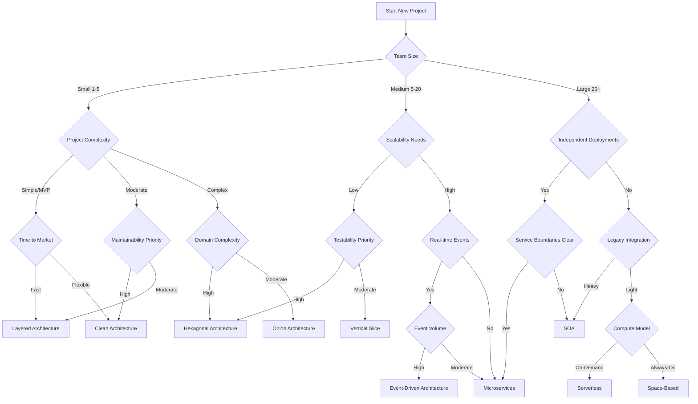

# Architecture Decision Flow Diagram

Use this diagram to help decide which architectural pattern best fits your project requirements.

---

## Quick Reference Guide

| Architecture | Best For | Trade-offs |
|-------------|----------|------------|
| **Layered (N-Tier)** | Simple apps, MVPs, small teams | Fast start, but can become rigid |
| **Clean Architecture** | Domain-centric apps, testability | Learning curve, more boilerplate |
| **Hexagonal** | High testability, external integrations | Complexity increases with ports |
| **Onion** | Domain isolation, dependency control | Similar to Clean, steeper curve |
| **Vertical Slice** | Feature-focused teams, rapid iteration | Can lead to duplication |
| **Microservices** | Large teams, independent scaling | Operational complexity |
| **SOA** | Enterprise integration, legacy systems | Can be heavyweight |
| **Event-Driven** | Real-time, high throughput, decoupling | Debugging complexity |
| **Serverless** | Variable workloads, cost optimization | Cold starts, vendor lock-in |
| **Space-Based** | Extreme scalability, high availability | Infrastructure complexity |
